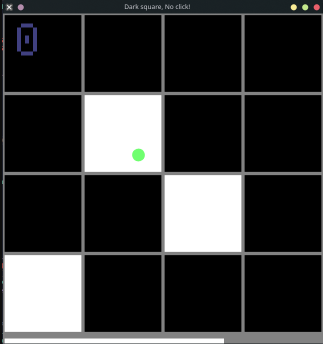

# Dark square, no click!
A game inspired by [White tile, don't tap it!](https://www.donttap.com/)

## [DOWNLOAD](https://github.com/wait-what/dark-square-no-click/releases)

## Game rules
- There is a 4x4 (customizable) grid with 3 targets (customizable)
- You have 15 seconds (customizable) to click as many white squares as you can
- The game ends when you click a black square or run out of time
- You can use `left`/`right` mouse buttons and `Z`/`X` on your keyboard to click the squares
- To restart, press `space`

> For a better experience, **disable vsync**! On linux with the mesa driver, this can be accomplished using `export vblank_mode=0`

## Pre-built downloads
[**DOWNLOAD HERE**](https://github.com/wait-what/dark-square-no-click/releases) if you don't feel like building it yourself

Windows and Defender will probabably get mad at the files! If you do not trust my builds, that's on you - compile it yourself

NOTE: The pre-built binaries are treated with `strip bin` (from `GNU binutils`) and `upx --best --lzma bin`

## Building and customization
- Make sure you have rust installed and properly configured
- Set the values you want near the top of [main.rs](./src/main.rs)
- `cargo run --release`

## Why no WebAssembly?
I have no idea how to do that. I am using [not3fl/macroquad](https://github.com/not-fl3/macroquad), which is supposed to somewhat have WASM support? I would really appreciate it if someone added support for WASM and made a pull/merge request

## Sounds
The sounds are taken from [here](https://www.decentsamples.com/product/tiger-xylophone-kontakt-sfz/). I believe these are free to use (I hope). If they are not, open an issue in this repository to tell me.

## License
The project is licensed under [MIT](./LICENSE)
